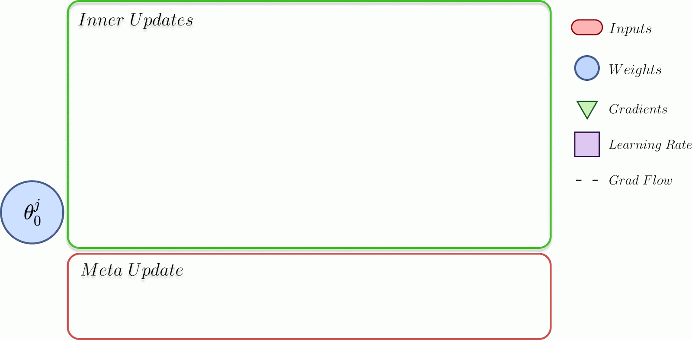
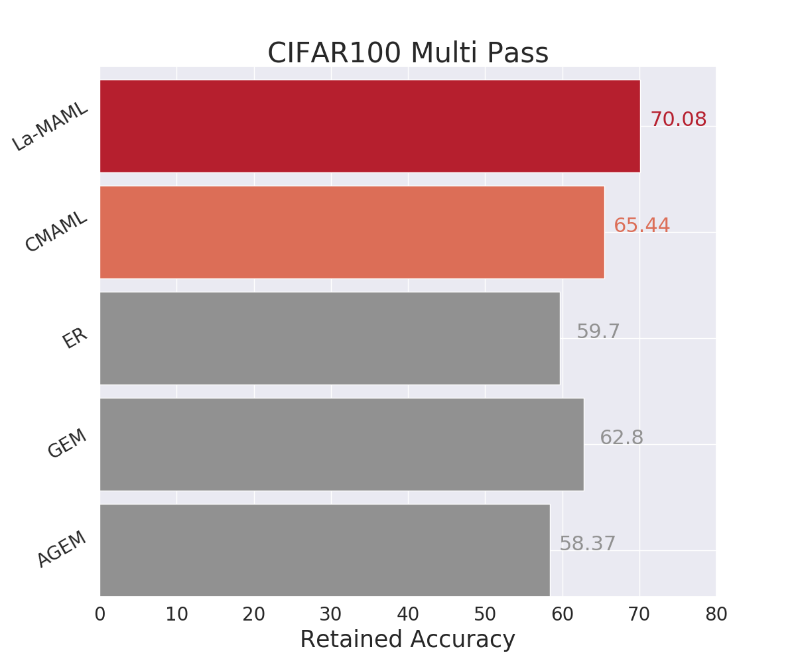
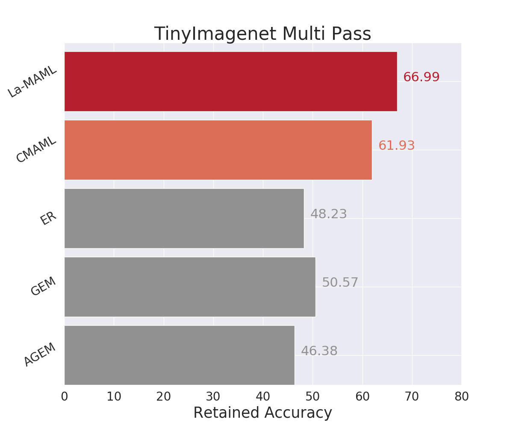
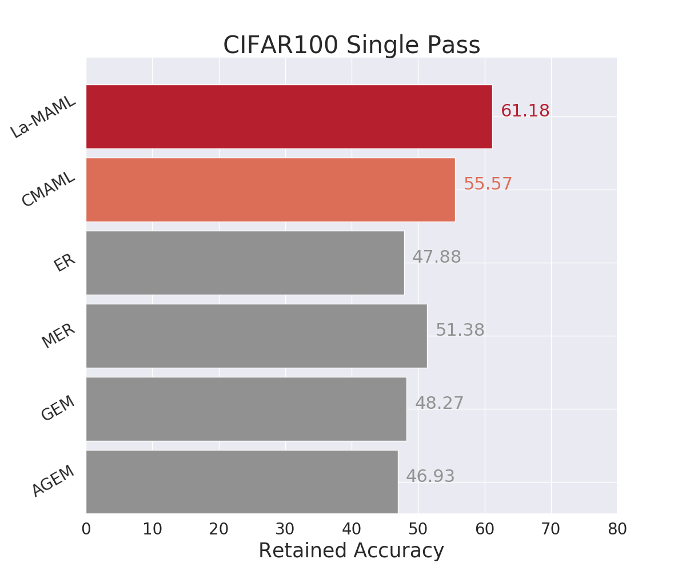
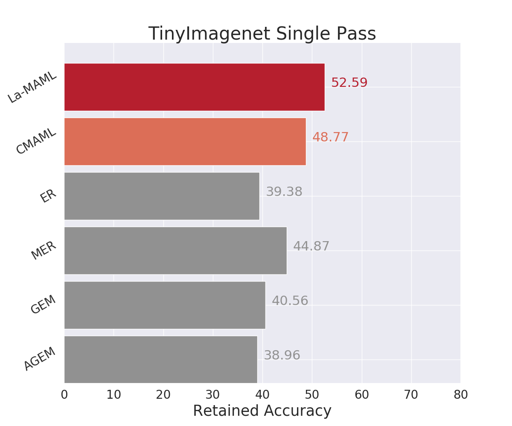

# La-MAML

This repository is the official implementation of **Look-Ahead Meta-Learning for Continual Learning** which was accepted at Neurips 2020 (Oral).

<font size="+1">[Paper](https://arxiv.org/abs/2007.13904) | [Blog](https://mila.quebec/en/blog/) | [Video](https://www.youtube.com/watch?v=HzewyVu8LaY)</font>



## Available Datasets

The code works for varient of MNIST and task incremental version of CIFAR100 and TinyImageNet. To download the different versions of MNIST CL benchmarks use the file ```get_data.py``` as follows

```python get_data.py all```

CIFAR100 is automatically downloaded when you run a script for CIFAR experiments.

For TinyImageNet, first give the correct permissions to the download script:

```chmod +x download_tinyimgnet.sh```

Then, run the following commands to download and process the data for use by Pytorch Dataloader:

```./download_tinyimgnet.sh```

## Basic Setup

As a first step to get up and running, use this repository and navigate into the root directory of your local version of the repository. To get started, please install the requirements inside your environment using conda. Type the following in your terminal:

```conda env create -f environment.yml```

Once completed source your environment using:

```conda activate lamaml```

This will create a conda environment (an isolated workplace) with most of the files installed in it. The rest of the files can be installed using pip:

```pip install -r requirements.txt```

## Available Algorithms

We provide the implementations of the following algorithms for the CIFAR and TinyImageNet datasets: - 

```
IID
ER
La-ER
iCarl
GEM
AGEM
MER
Meta-BGD
CMAML
Sync
La-MAML
```
For the MNIST experiments, we have only tested `CMAML`, `Sync` and `La-MAML`.

## Getting Started

In run_experiments.sh see examples of how to run variants of la_maml from the paper and baseline models from the experiments. First run the following command:

```chmod +x run_experiments.sh```

Finally, you can run all the experiments using the following command:

```
./run_experiments.sh
```
It is also possible to run a single algorithm at once. For that look into the run_experiments.sh file to access the arguments and hyperparams required for a particular algorithm.


## Results

Our model achieves the following performance on the Real-World Classification experiments:

<p float="left">
  
   
</p>

<p float="left">
  
   
</p>

Checkout Table 1 and 3 in our [Paper](https://arxiv.org/abs/2007.13904) for more results.

## Citation

```
@article{gupta2020maml,
  title={La-MAML: Look-ahead Meta Learning for Continual Learning},
  author={Gupta, Gunshi and Yadav, Karmesh and Paull, Liam},
  journal={arXiv preprint arXiv:2007.13904},
  year={2020}
}
```
